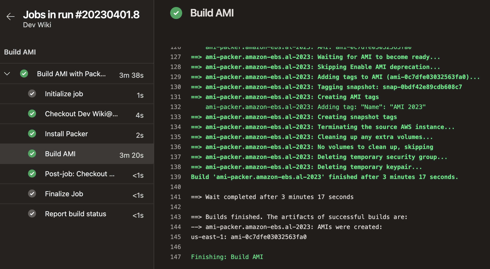
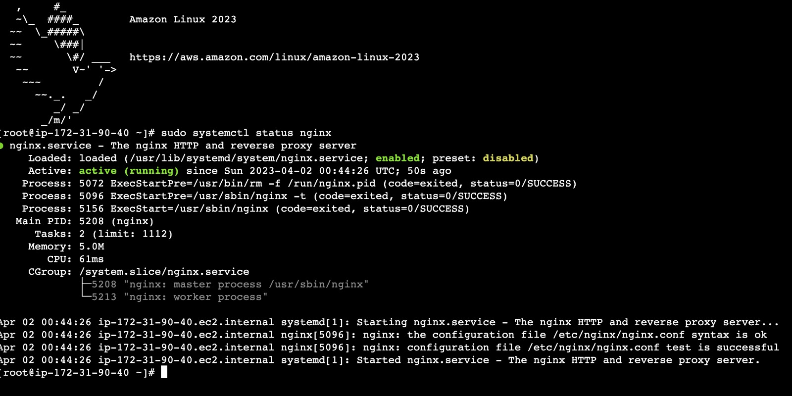

# Criando AMI usando o Packer e Amazon Linux 2023 (AL2023) com o Azure Pipelines

Recentemente a AWS anunciou o novo sistema operacional da AWS baseado em Linux. Tem um comparativo super legal entre Amazon Linux 2 e Amazon Linux 2023 \[nesse link\](https://docs.aws.amazon.com/linux/al2023/ug/compare-with-al2.html). 
Resolvi testar o novo sistema operacional criando a AMI com o Packer. 

Packer HashiCorp é uma ferramenta de automação de criação de imagens de máquinas virtuais que permite criar imagens idênticas para múltiplas plataformas usando arquivos de configuração.

Para instalar o Packer, siga as etapas abaixo:

1.  Acesse o site oficial do Packer: [https://www.packer.io/downloads](https://www.packer.io/downloads)
2.  Faça o download da versão do Packer compatível com o seu sistema operacional.
3.  Extraia o arquivo ZIP baixado em uma pasta de sua escolha.
4.  Adicione a pasta contendo o executável do Packer ao PATH do sistema para que possa ser acessado de qualquer lugar no terminal.
5.  Para verificar se o Packer foi instalado corretamente, abra o terminal e digite o comando "packer version". Se a instalação foi bem-sucedida, a versão do Packer instalada será exibida.

Obs_1: As etapas exatas podem variar dependendo do sistema operacional em que o Packer está sendo instalado.

Obs_2: Essa etapa é apenas informativa, vou utilizar o Azure Pipelines no tutorial abaixo.

Assim como os outros produtos da HashiCorp ele utiliza o HCL2 como linguagem, mas nem sempre foi assim, antes ele utilizava json como linguagem e como ainda estão em fase de migração tem um how to de como fazer a migração para HCL2 \[aqui\]([https://developer.hashicorp.com/packer/tutorials/configuration-language/hcl2-upgrade](https://developer.hashicorp.com/packer/tutorials/configuration-language/hcl2-upgrade)).

Você pode estar organizando o seu diretório packer com os arquivos abaixo, vamos ver o conteúdo de cada um deles.

```markdown

├── packer
│    └── provider.pkr.hcl
│    └── builders.pkr.hcl
│    └── sources.pkr.hcl
│    └── variable.pkr.hcl
│    └── locals.pkr.hcl
├── install
│    └── nginx.sh
├── pipelines
│    └── azure_pipelines.yml
```

**provider.pkr.hcl** Contém informações sobre o tipo de provedor, como o nome da conta, região e outras configurações específicas do provedor. Vamos ao código:

```terraform
#provider.pkr.hcl
packer {
  required_plugins {
    amazon = {
      version = ">= 1.2.2"
      source  = "github.com/hashicorp/amazon"
    }
  }
}
```

**builders.pkr.hcl** Contém informações sobre o tipo de máquina virtual que será criada, como sistema operacional, tamanho da memória, armazenamento e outras configurações relacionadas à infraestrutura. Vamos ao código:

```terraform
#builders.pkr.hcl
build {
  name    = "ami-packer"
  sources = ["source.amazon-ebs.al-2023"]

  provisioner "shell" {
    environment_vars = ["FOO=hello world"]
    script           = "../install/nginx.sh"
    pause_before     = "10s"
    timeout          = "10s"
  }
}
```

**sources.pkr.hcl** Contém informações sobre o tipo de origem, como um arquivo ISO, uma imagem pré-existente ou uma receita do Chef. Vamos ao código:

```terraform
#sources.pkr.hcl
source "amazon-ebs" "al-2023" {
  ami_name      = "${var.ami_prefix}-${local.timestamp}"
  instance_type = "t3.micro"
  region        = "us-east-1"
  source_ami_filter {
    filters = {
      name                = "al2023-ami-2023.*-kernel-6.1-x86_64"
      root-device-type    = "ebs"
      virtualization-type = "hvm"
    }
    most_recent = true
    owners      = ["amazon"]
  }
  ssh_username = "ec2-user"
  tags = {
    Name = "AMI 2023"
  }
}
```

**variable.pkr.hcl** Contém informações sobre o tipo de variável, como seu nome, tipo e valor padrão, que podem ser substituídos por um valor personalizado durante a execução do processo. Vamos ao código:

```terraform
#variable.pkr.hcl
variable "ami_prefix" {
  type    = string
  default = "AMI"
}
```

**locals.pkr.hcl** E Um valor local atribui um nome a uma expressão , portanto, você pode usar o nome várias vezes em um módulo em vez de repetir a expressão. Vamos ao código:

```terraform
#locals.pkr.hcl
locals {
  timestamp = regex_replace(timestamp(), "[- TZ:]", "")
}
```

Criei o diretório **install** apenas para organizar os scripts de instalação do que for interessante, no caso vou estar instalando o Nginx com um arquivo shell **nginx.sh**. Vamos ao código:

```shell
#nginx.sh
#!/bin/bash

# Atualiza os pacotes
sudo dnf update -y

# Instala o Nginx
sudo dnf install nginx -y

# Inicia o serviço do Nginx
sudo systemctl start nginx

# Habilita o serviço do Nginx para iniciar automaticamente na inicialização do sistema
sudo systemctl enable nginx

# Verifica o status do Nginx
sudo systemctl status nginx
```

Tudo certo, vamos agora ao Azure Pipelines. 

Para organizar também criei um diretório chamado pipelines e inclui o arquivo azure_pipelines.yml. Vamos ao código:

```yaml
#azure_pipelines.yml
trigger:
  branches:
    include:
    - master
pool:
  vmImage: Ubuntu-20.04
stages:
- stage: BuildAMI
  displayName: Build AMI
  jobs:
  - job: BuildAMI
    displayName: 'Build AMI with Packer'
    steps:
      - task: Bash@3
        displayName: 'Install Packer'
        inputs:
          targetType: 'inline'
          script: |
              echo "# Downloading Packer v1.8.6"
              wget https://releases.hashicorp.com/packer/1.7.6/packer_1.7.6_linux_amd64.zip
              echo "# Unzipping files"
              unzip packer_1.7.6_linux_amd64.zip
          
              echo "# Configuring packer and checking version"
              export PACKER_PATH=$(which packer)
              ls -lha
              sudo mv packer $PACKER_PATH

              packer -v
      - task: AWSShellScript@1
        displayName: 'Build AMI'
        inputs:
          awsCredentials: aws-teste-dev
          regionName: $(AWS_REGION)
          scriptType: 'inline'
          inlineScript: |
            cd projects/PocPacker/packer
            packer init .
            packer build .
```

Em outro post eu explico com mais detalhes como executar uma pipeline no Azure Pipelines. Bora executar a pipeline.

Crie um repositório no Azure Repos

Para criar um novo repositório no Azure Repos, siga os seguintes passos:

1.  Abra o seu projeto no Azure DevOps;
2.  Selecione a opção Repositórios no menu lateral esquerdo;
3.  Clique em Novo Repositório no canto superior direito;
4.  Selecione o tipo de repositório que deseja criar (Git ou Team Foundation Version Control);
5.  Defina as opções de configuração do repositório, como nome, descrição e visibilidade;
6.  Clique em Criar para criar o novo repositório.

Após criar o repositório, você poderá cloná-lo localmente para trabalhar em sua máquina, além de adicionar, editar e remover arquivos, criar ramificações e realizar outras operações de gerenciamento de código.

Tudo certo, é só enviar o código para o Azure Repos

1.  Faça o download e instale um cliente de controle de versão de sua preferência, como o Git ou o Azure Repos Extension para o Visual Studio;
2.  Inicialize um repositório Git em seu projeto local, se ainda não tiver feito isso, usando o comando "git init";
3.  Adicione os arquivos e pastas ao seu repositório local usando o comando "git add";
4.  Grave suas alterações locais no repositório usando o comando "git commit";
5.  Conecte seu repositório local ao repositório remoto no Azure Repos usando o comando "git remote add origin <URL do repositório remoto>";
6.  Empurre suas alterações locais para o repositório remoto usando o comando "git push origin <branch>"

Por último, vamos criar o pipeline no Azure Pipelines.
    
1.  Selecione o projeto que deseja configurar o pipeline;
2.  Clique em "Pipelines" no menu à esquerda e depois em "New Pipeline";
3.  Escolha o repositório que contém o código do seu projeto (GitHub, Bitbucket, Azure Repos, etc);
4.  Selecione o template do pipeline que deseja utilizar (como .NET Core, Node.js, Python, etc) ou comece do zero;
5.  Configure o pipeline, adicionando tarefas, definindo variáveis, configurando gatilhos e definindo opções de agendamento;
6.  Salve e execute o pipeline.
    
Agora é só acompanhar o andamento.
    


Criei uma instância EC2 para ver se está tudo ok a partir da imagem que criamos. 
    


Espero que tenha gostado, criei um repositório no github com todo código utilizado [https://github.com/brbernardo/packer](https://github.com/brbernardo/packer)

Vlw flw.